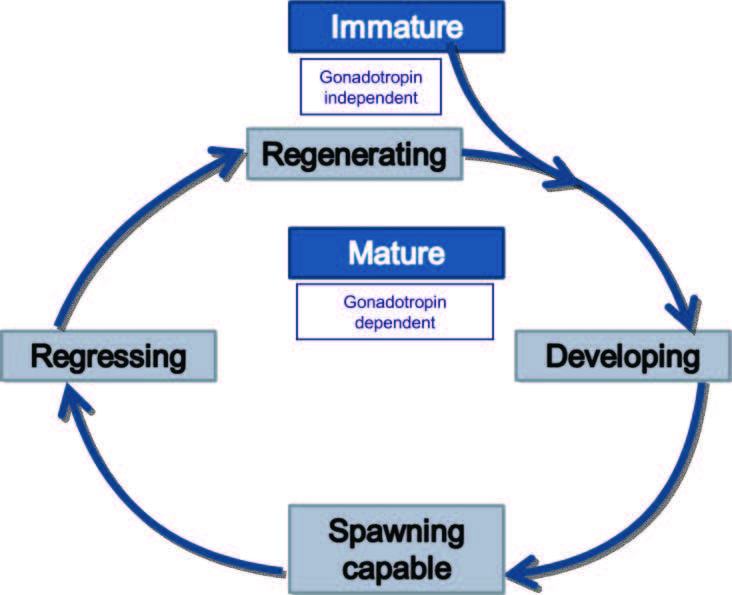

 

### FEMALE REPRODUCTIVE PHASES

Standardized terminology is important for understanding and sharing reproductive research. A large effort has been made to standardize and create common terminology (see [Brown-Peterson et al 2011](https://drive.google.com/file/d/1oqbMgtJVdGzCix4THoqYJdRgROd8dOL1/view?usp=sharing)), however you will commonly see multiple terms and different names and criteria for reproductive phases. It is recommended that you use the terminology and reproductive phase criteria from Brown-Peterson et al 2011. Phase characteristic descriptions below are taken from Brown-Peterson et al 2011. See reference for all prior terminology and more detailed descriptions and examples of reproductive phases.

{width=50%}

Figure 1. Conceptual model of fish reproductive phase terminology. From Brown-Peterson et al 2011. 

 

{width=70%}  

Figure 2. Cellular dynamics involved with gametogenesis. From: F. Saborido-Rey, in Encyclopedia of Ocean Sciences (Third Edition), 2016.

### Immature

General characteristics: Only oogonia and PG oocytes present (chromatin nucleolar (large germinal vesicle surrounded by a thin layer of cytoplasm), and perinucleolar (germinal vesicle increases in size and nuclei appear at its periphery) oocytes, muscle bundles absent, blood vessels indistinct. Thin tunica (i.e. gonad/ovary wall) and little space between oocytes.

  
 
### Developing
Developing phase is generally split into at least two phases to separate early developing subphase from later development.

General characteristics: Enlarging ovaries and blood vessels becoming more distinct. Can have PG, CA, VT1, VT2 oocytes present. Some atresia can be present but no POFS or VT3.

Early Developing: PG and cortical alveolar oocytes (CA; appearance of cortical alveoli (yolk vesicles) in the cytoplasm and formation of the vitelline membrane. 

Developing: vitellogenic oocytes, VT1, and/or VTII present.

 

### Spawning capable
General characteristics: Large ovaries, blood vessels prominent. Individual oocytes visible macroscopically. Vtg3 oocytes present or POFs present in batch spawners. Atresia of vitellogenic and/or hydrated oocytes may be present. 
 
Actively spawning (subphase of spawning capable): oocytes undergoing late germ vesicle migration, germ vesicle break down, hydration, or ovulation.

 

### Regressing
General characteristics: Flaccid ovaries, blood vessels and muscle bundles prominent. Atresia (any
stage) present. Can have post ovulatory follicles. Some CA and/or vitellogenic
(Vtg1, Vtg2) oocytes present.

 

### Regenerating
General characteristics: Small ovaries, blood vessels reduced but present. Only oogonia and/or PG oocytes present. Muscle bundles, enlarged blood vessels, thick ovarian wall and/or gamma/delta atresia or old, degenerating POFs may be
present.

 

### MALE REPRODUCTIVE PHASES

 

### Immature
General characteristics: Small testes, often clear and threadlike. Only Sg1 present; no lumen in lobules.

 

### Developing
General characteristics: Small testes but easily identified. Spermatocysts evident along lobules. Sg2, Sc1, Sc2, St, and Sz can be present in spermatocysts. Sz not present in lumen of lobules or in sperm ducts. GE continuous throughout.  
Early developing subphase: Sg1, Sg2, and Sc1 only.

 

### Spawning capable
General characteristics: Large and firm testes. Sz in lumen of lobules and/or sperm ducts. All stages of spermatogenesis (Sg2, Sc, St, Sz) can be present. Spermatocysts throughout testis, active spermatogenesis. GE can be continuous or discontinuous. Actively spawning subphase (macroscopic): milt released with gentle pressure on abdomen.  
Histological subphases based on structure of GE.
Early GE: continuous GE in all lobules throughout testes.  
Mid-GE: continuous GE in spermatocysts at testis periphery, discontinuous GE in lobules near ducts.  
Late-GE: discontinuous GE in all lobules throughout testes.  

 

### Regressing
General characteristics: Small and flaccid testes, no milt release with pressure.Residual Sz present in lumen of lobules and in sperm ducts. Widely scattered spermatocysts near periphery containing Sc2, St, Sz. Little to no active spermatogenesis. Spermatogonial proliferation and regeneration of GE common in periphery of testes.

 

### Regenerating
General characteristics: Small testes, often threadlike. No spermatocysts. Lumen of lobule often nonexistent. Proliferation of spermatogonia throughout testes. GE continuous throughout. Small amount of residual Sz occasionally present in lumen of lobules and in sperm duct.
