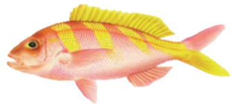
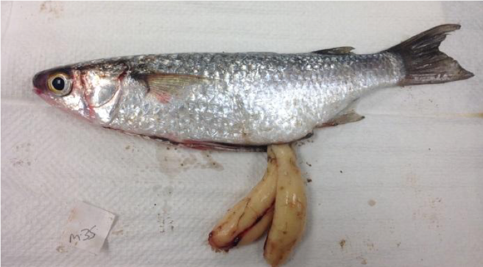

This is the landing page for exploring developmental sequences for a variety of species with differing gender systems (gonochoristic, hermaphroditic), oocyte development (synchronous, asynchronous, group synchronous), and spawning types (egg layers [demersal or pelagic], live bearers). Fish with images have full pdf developmental sequences using the MARVLS template, otherwise the publication is linked with the histological figures.

## Clupeiformes
### Clupeidae

[*Acanthocybium solandri* (Wahoo) publication see Fig. 3](http://www.publish.csiro.au/nid/126/paper/MF08211.htm)

 
 
[*Alosa sapidissima* (American Shad) publication see Fig. 1](http://dx.doi.org/10.1080/00028487.2013.862178)

 

 
## Scombriformes
### Scombridae

[*Acanthocybium solandri* (Wahoo) publication see Fig. 3](http://www.publish.csiro.au/nid/126/paper/MF08211.htm)
 

## Lophiiformes
### Lophiidae

[*Lophius americanus* (Goosefish) publication see Fig. 2](http://dx.doi.org/10.1111/jfb.13272 )
  

## Perciformes
### Coryphaenidae

[*Coryphaena hippurus* (Dolphinfish) publication see Fig. 1](http://dx.doi.org/10.5343/bms.2011.1096)
 

### Hemiramphidae

[*Hemiramphus brasiliensis* and *H. balao* (Ballyhoo halfbeak) publication see Fig. 4](http://dx.doi.org/10.2307/1543496)
 

### Labridae

[*Lachnolaimus maximus* (Hogfish) publication see Fig. 2 & Fig. 7 ](http://dx.doi.org/10.1111/j.1095-8649.2007.01580.x)
 

### Acanthuridae

[*Acanthurus triostegus* (Convict Tang) publication see Fig. 2](https://doi.org/10.1007/s10641-016-0566-x)
 

### Malacanthidae

[*Lopholatilus chamaeleonticeps* (Tilefish) publication see Fig. 5](https://doi.org/10.7755/FB.111.2.4)
 

### Carangidae

[*Decapterus punctatus* (Round Scad) publication see Fig. 4](http://dx.doi.org/10.1007/s00227-001-0759-4)
 

[*Trachurus trachurus* (Horse Mackerel) publication see Fig. 2](https://doi.org/10.1016/j.fishres.2018.11.026)
 

### Kuhliidae

 {width=25%}  [*Kuhlia xenura* (Hawaii flagtail)](https://drive.google.com/file/d/12jMayyP5BzFZ2_ug9O-kG8HBP1fShI7w/view?usp=sharing)

 

### Serranidae

{width=25%}  [*Cephalopholis argus* (Peacock Grouper)](https://drive.google.com/file/d/12aLBaZq41gWny1YG75hJJ2zCpA8c6roV/view?usp=sharing). [Publication see Fig. 2 & Fig. 3]( http://dx.doi.org/10.1111/j.1095-8649.2007.01580.x)

 

[*Pronotogrammus martinicensis* (Roughtongue Bass) publication see Fig. 2](https://doi.org/10.18785/goms.2701.04)
 

### Lutjanidae

{width=25%}  [*Prisitpomoides zonatus* (Gindai or Oblique-Banded Snapper)](https://drive.google.com/file/d/1UKJy_CWqEUjtIK1jaOa_pzXwWP7qftJU/view?usp=sharing). [Publication see Fig. 7](https://doi.org/10.1071/MF21094)

## Pleuronectiformes
### Pleuronectidae

[*Pseudopleuronectes americanus* (Winter Flounder-Females) publication see Fig. 2 & Fig. 3](http://doi.org/10.1111/jfb.12431)
 

[*Pseudopleuronectes americanus* (Winter Flounder-Males) publication see Fig. 2](https://doi.org/10.1016/j.fishres.2019.02.006)
 

## Mugiliformes
### Mugilidae

{width=25%}  [*Osteomugil engeli* (Kanda Mullet)](https://drive.google.com/file/d/1D1GlNkhDop8oo7KlZ_fMVnk6rVcgUGOh/view?usp=sharing).  [Publication see Fig. 2 & Fig. 3](https://link.springer.com/article/10.1007/s10641-019-00853-y)
 

